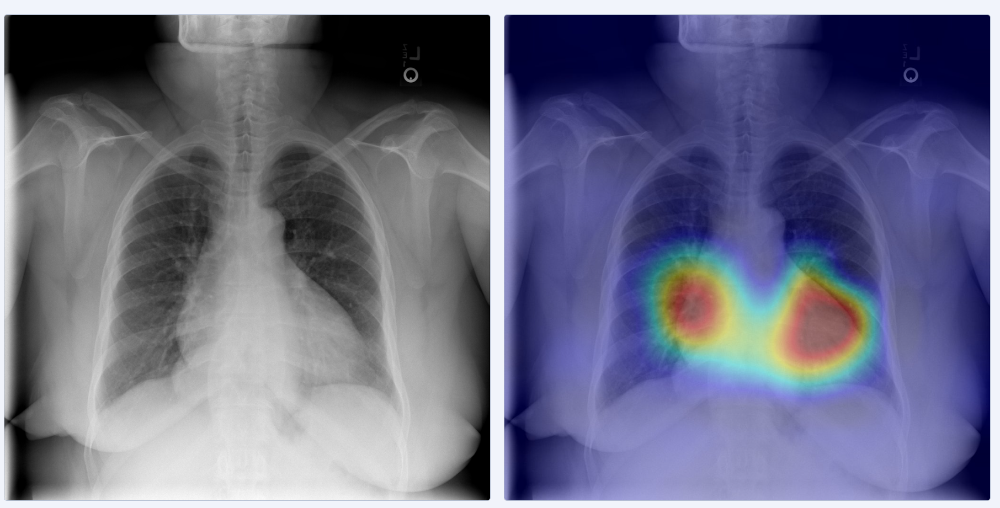
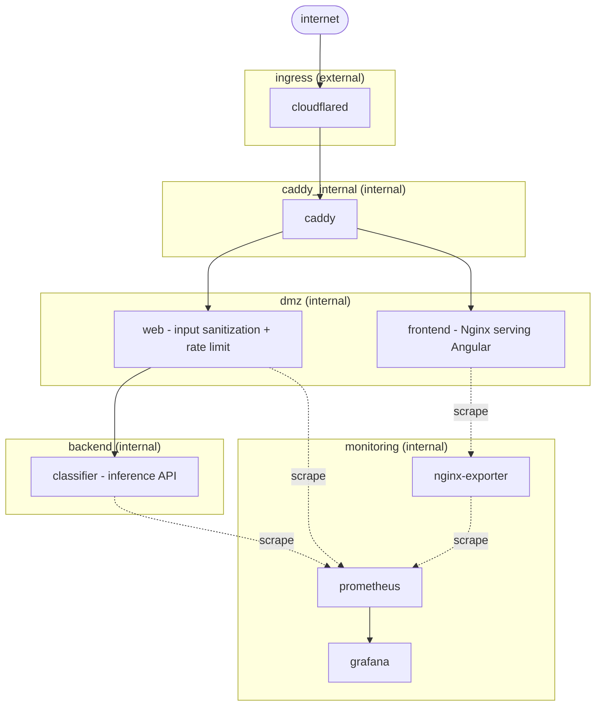

# Chest X-ray Multi-Classifier

### Description

Multi-label chest X-ray classifier screening 14 thoracic diseases simultaneously, achieving 81.7% mean AUC on the NIH CXR8 dataset including data reserved for thresholds optimizing for sensitivity. Deployed as a secure microservice stack with defense-in-depth network isolation, it features image submission, attention and saliency map compared to the original image, sensitivity-optimized thresholds, an interactive results page to display model accuracy metrics, and Grafana for realtime metric monitoring.

Currently experimenting with additional thresholding ideas to indicate confidence.

Cardiomegaly - an enlarged heart



The model is optimized for clinical relevance, using sensitivity threshold optimization: the model is more sensitive to anomalies, resulting in higher false positives but fewer false negatives. False negatives result in the patient being sent home with a disease; thus, the decision was made to optimize thresholds to prevent this.

The latest feature includes an addition threshold used to indicate high confidence.

<br>

## Local Execution

Clone the repository.

```bash
git clone https://github.com/ncalabro18/Chest-X-ray-Classifier
cd Chest-X-ray-Classifier
```

Create passwords for your environment using a text editor.

```bash
vim .env
```

Match variable names to:

```bash
CLASSIFIER_API_KEY=...
GRAFANA_ADMIN_PASSWORD=...
INTERNAL_SECRET=...
```


For local development ```CF_API_TOKEN``` and ```CLOUDFLARE_TUNNEL_TOKEN``` are not needed.
The other 3 should be randomly initialized with a secure generator:
```bash
openssl rand -base64 32
```
<br>

### Classifier Web Server
#### Run Development Webapp

```bash
make dev
```
Is all that is needed. Navigate to http://localhost
Local testing happens over http, not https.


#### Run Production Webapp

To deploy, edit the domain in caddyfile and create a Cloudflare Tunnel that points to http://caddy:80. Terminate TLS at the tunnel. Add Cloudflare Tunnel and API tokens to ```.env```

```bash
CLOUDFLARE_TUNNEL_TOKEN=...
CF_API_TOKEN=...
```


There are three other profiles:
  - monitoring starts Grafana
  - cve_scan checks for common vulnerabilities and expsures
  - lint runs Angular's TypeScript linter

```bash
make cve_scan   
make monitoring # grafana only; prometheus is always up
make lint
```

Grafana default address:      ```http://localhost:3000```
Development frontend address: ```http://localhost:14000```

<br>

### Model Training / Reproduction

Recommended Python 3.11 for training

```python --version```

```pip install -r requirements.txt```


Beyond Python and pip dependencies there are 2 more downloads:

  [NIH Chest X-ray dataset](https://nihcc.app.box.com/v/ChestXray-NIHCC) (42 GB)
  
  To run train.py, all *_PATH variables must resolve. This includes the image root, metadata file (both in the link above), and checkpoint file.

  __Note:__ Dataset is for training / validation purposes only. See [Web Server](#classifier-web-server)

  [Custom Backbone Checkpoint](https://github.com/ncalabro18/Chest-X-ray-Classifier/releases/tag/checkpoint_file) (.2 GB)


Use the 3.11 interpreter to run train.py. No arguments are needed.
The script run_model.sh is useful to control GPU selection and python interpreter; edit the path to your local setup.


```./run_model.sh train.py```

This will output a best checkpoint, log file, and 2 CSV files

<br>

## Architecture

[About model webpage](https://classifier.ncalabro.net/about)

### Data Preprocessing / Augmentation

The training pipeline applies a sequence of image augmentations to improve
model robustness and generalization. Tuning parameters are kept conservative as X-ray anatomical structures can be easily distorted.

#### Geometric Augmentations
- Resize input images to a fixed resolution
- Random horizontal flipping
- Random rotation
- Elastic deformation
- Grid distortion

#### Contrast & Intensity Augmentations
- CLAHE (Contrast Limited Adaptive Histogram Equalization)
- Brightness and contrast jitter
- Random gamma adjustment

#### Noise & Regularization
- Gaussian noise injection
- Coarse dropout / random region masking


### Backbone

Pretrained on the NIH Chest X-ray dataset, SimMIM is utilized to learn features by masking 60% of the image.

The main modification is that stage outputs 0-2 are tapped before their respective patch-merging layers, giving the head access to higher resolution but lower channel feature maps for multi-scale fusion. Stage 3 has no merging and feeds directly into the backbone's LayerNorm, after which its tokens are passed to the head alongside the tapped early features.

### Head

The head receives token streams from all four backbone stages. The three early stages (0-2) each go through a stage_proj - a bottleneck Conv2d pair that projects each stage's native channel dimension down to C/4 then back up to C, after spatially pooling to a common 7×7 grid. Each projected map is then gated by a learned scalar (1 + tanh(gate_i)), letting the model suppress or amplify each scale's contribution. The gated stage tokens are concatenated with the final-stage tokens (scaled by a softplus temperature), then passed through a shared LayerNorm.

Cross-attention then operates with num_classes learned query vectors against this full multi-scale token set, producing one feature vector per class. The conditioned class features go through a three-layer MLP head (C -> 256 -> 1) to produce the final per-class logits.


### Thresholding

After probability scores are calculated, final thresholds are applied to aid in diagnostic capabilities. These are selected to minimize false negatives, known as sensitivity optimization.


### Model Output

The model gives final probabilities which can be tuned to optimize for different goals. For the final model, sensitivity optimization is utilized rather than f1 or Youden's J statistic.

Attention maps and saliency maps are generated to display the decision making areas with the hightest weights for each positive finding.

<br>

## Results

Mean AUC of 81.5% on a patient-level held-out validation set, competitive with published benchmarks on this dataset. Thresholds are optimized for sensitivity rather than F1, prioritizing recall to minimize missed diagnoses.

Future efforts will focus on multi-image analysis, increasing generalization with extra datsets, and improving maintainability.

<br>

## Dataset

The NIH Chest X-ray Dataset contains 112,120 images of various resolutions
It includes 14 disease categories with a large imbalance:
```
No Finding           | ██████████████████████████████████████████████ 60361
Infiltration         | ████████████████ 19894
Effusion             | ████████████ 13317
Atelectasis          | ███████████ 11559
Nodule               | ██████ 6331
Mass                 | █████ 5782
Pneumothorax         | █████ 5302
Consolidation        | ████ 4667
Pleural Thickening   | ███ 3385
Cardiomegaly         | ██ 2776
Emphysema            | ██ 2516
Edema                | ██ 2303
Fibrosis             | █ 1686
Pneumonia            | █ 1431
Hernia               | ▏ 227
```
Mean: ```5798.3```

Standard Deviation: ```5429.6```

<br>

## Network / Microservice Diagram




## Authors

Nicholas Calabro

Instructed by Professor Wenjin Zhou

Thank you for contributions to the documentation by:

Anthony Klimas

Luke MacVicar

Hilary Jaen Rodriguez


Extended Final Project for a Computer Science Special Topics Elective: _Computing for Health and Medicine_

[Professor Wenjin's Course Page](https://www.cs.uml.edu/~wzhou/comp5300.html)

<br>

## References

### NIH Chest X-ray Dataset
Wang, X., Peng, Y., Lu, L., Lu, Z., Bagheri, M., & Summers, R. M. (2017).  
*ChestX-ray8: Hospital-scale Chest X-ray Database and Benchmarks on Weakly-Supervised Classification and Localization of Common Thorax Diseases.*  
Proceedings of the IEEE Conference on Computer Vision and Pattern Recognition (CVPR).  
https://doi.org/10.1109/CVPR.2017.369

### Swin Transformer v2
Liu, Z., Hu, H., Lin, Y., Yao, Z., Xie, Z., Wei, Y., Ning, J., Cao, Y., Zhang, Z., Dong, L., Wei, F., & Guo, B. (2022).  
*Swin Transformer V2: Scaling Up Capacity and Resolution.*  
Proceedings of the IEEE/CVF Conference on Computer Vision and Pattern Recognition (CVPR).  
https://doi.org/10.1109/CVPR52688.2022.01167

### Enlarged Heart (Cardiomegaly): What It Is, Symptoms & Treatment

Cleveland Clinic. (2022, July 10).  
*Enlarged Heart (Cardiomegaly): What It Is, Symptoms & Treatment.*  
Cleveland Clinic.  
https://my.clevelandclinic.org/health/diseases/21490-enlarged-heart-cardiomegaly